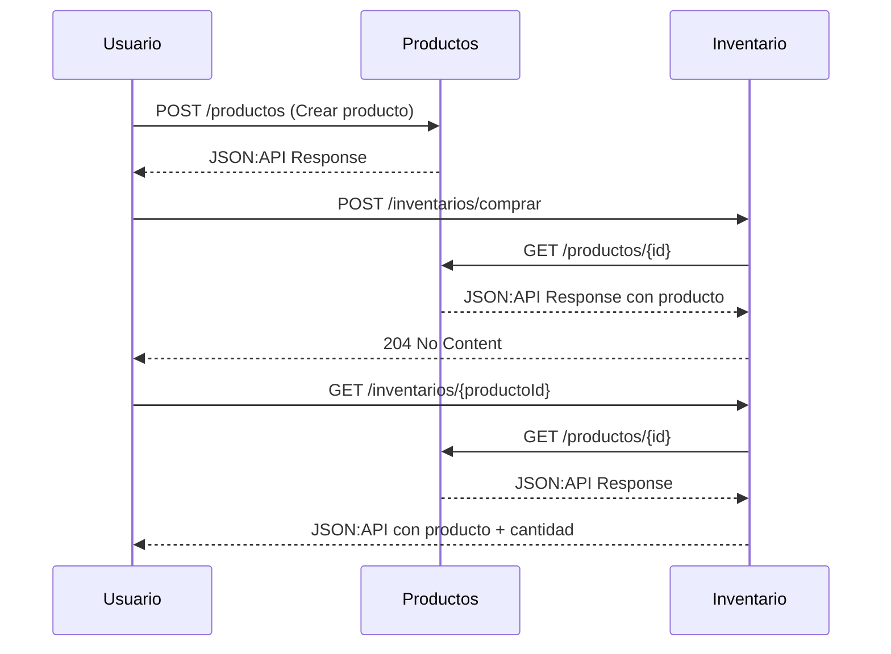

# LinkTic - Prueba Técnica Backend

# 🧩 Microservicios: Productos e Inventarios

Este proyecto está compuesto por dos microservicios: uno encargado de la gestión de productos y otro de la administración de inventario. Ambos se comunican utilizando el estándar [JSON:API](https://jsonapi.org/) y siguen una arquitectura **hexagonal**.

---

## ⚙️ Instrucciones de instalación y ejecución

### Requisitos
- Java 21
- Docker & Docker Compose
- Maven 3.9+
- Git

### Pasos para ejecutar el proyecto

1. **Clonar el repositorio**  
   ```bash
   git clone https://github.com/juanpa544/link-tic-prueba-tecnica
   cd link-tic-prueba-tecnica
   ```

2. **Levantar los contenedores con Docker Compose**  
   ```bash
   docker-compose up
   ```

3. **Endpoints disponibles**

   | Servicio       | URL base                  | Swagger                                     |
   |----------------|---------------------------|---------------------------------------------|
   | Productos      | http://localhost:8080     | http://localhost:8080/swagger-ui/index.html |
   | Inventario     | http://localhost:8081     | http://localhost:8082/swagger-ui/index.html |

---

## 🧱 Arquitectura

Se implementó **arquitectura hexagonal (Ports & Adapters)** para una alta separación de responsabilidades:

- **Dominio**: contiene los modelos y lógica de negocio central.
- **Aplicación**: casos de uso (services).
- **Infraestructura**: puertos de entrada (REST Controllers) y puertos de salida (Repositorios, clientes HTTP).
- **Adaptadores**: implementación concreta de puertos, como JPA, RestTemplate, etc.

Cada microservicio es completamente independiente, facilitando el despliegue, la prueba y el escalado.

---

## 🧠 Decisiones técnicas y justificaciones

- **Arquitectura Hexagonal** : Facilita pruebas, mantenibilidad y desacopla la lógica de negocio de la infraestructura.
- **H2 (Base de datos embebida)** : Se optó por bases de datos embebidas por facilidad de configuración, no requiere instalaciones adicionales ni configuración de instancias externas, lo que permite que el entorno esté listo rápidamente.

---

## 🔁 Diagrama de interacción entre servicios



---

## 🧪 Pruebas

- Pruebas unitarias con JUnit 5 y Mockito.
- Pruebas de integración con `@SpringBootTest` y base de datos H2.
- Controladores probados con `MockMvc`.

---

## 📦 Tecnologías utilizadas

- Java 21
- Spring Boot 3.5
- H2
- Docker & Docker Compose
- JSON:API
- JUnit & Mockito

## ✅ Pendientes / Mejoras Futuras
Implementar base de datos externa en producción.

Agregar monitoreo con Prometheus + Grafana.

Registrar eventos en Kafka u otro broker.

## 📬 Contacto
Para cualquier duda técnica sobre esta implementación, puedes comunicarte con:

Juan Pablo Blanco Márquez

Desarrollador Backend

📧 jblancomarquez54@gmail.com

📱 +57 350 5185330
